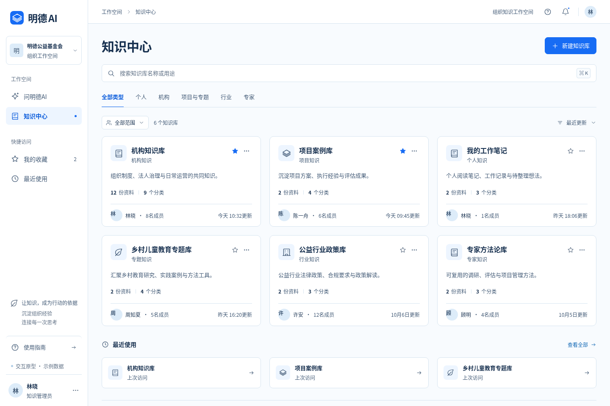
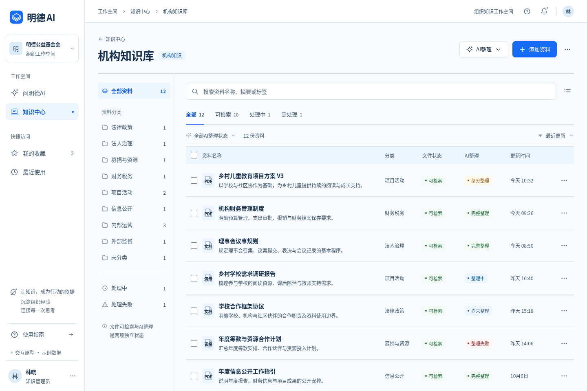
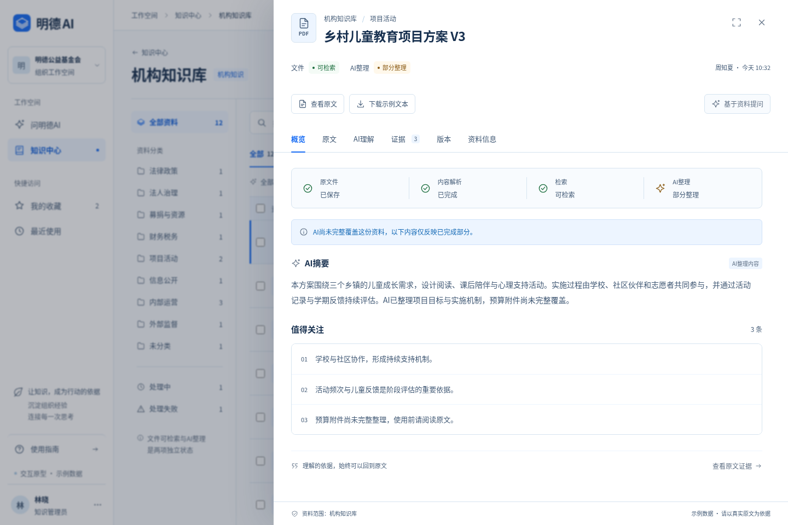
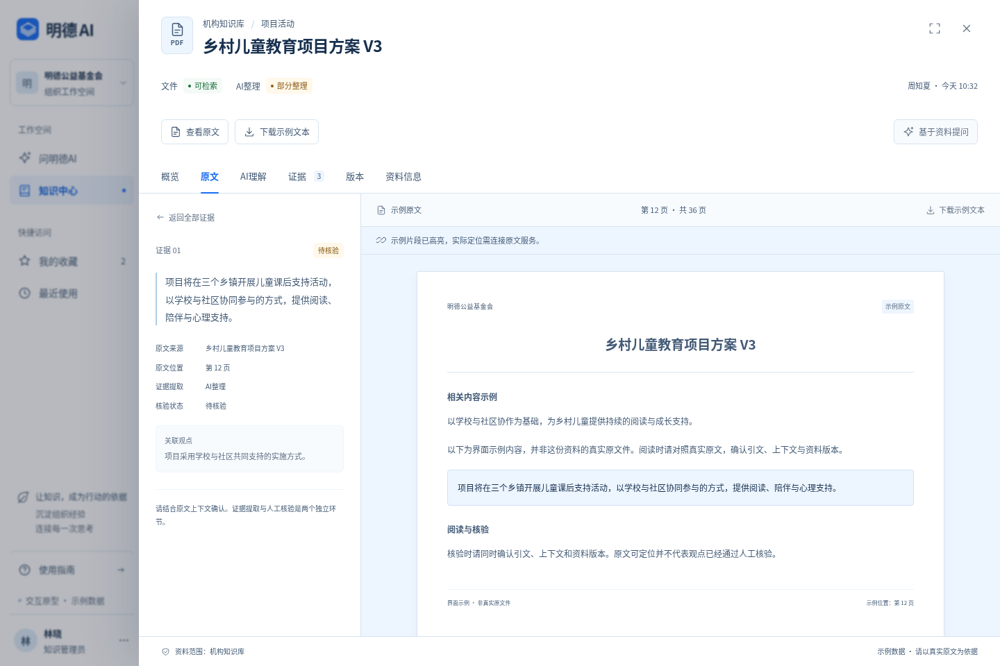

# 明德AI｜知识操作系统界面 V2 · 蓝白配色修订

本轮保留既有排版与交互，依据品牌规范统一为白色内容面、雾蓝层级、墨蓝文字和行动蓝操作。所有14张截图已同步重新生成。下面的图片来自真实浏览器渲染，桌面尺寸为 **1440 × 960**，手机尺寸为 **390 × 844**。文字、人数、资料与证据均为示例；未连接真实组织权限、文件处理、AI生成或知识检索服务。

[查看界面规范](../DESIGN-SYSTEM.md) · [查看运行说明](../../../DEVELOPMENT.md) · [查看交互验证脚本](../../../scripts/check-ui.py)

## 01｜知识中心

类型与关系范围分别筛选；默认卡片收为名称、用途、资料规模、负责人和成员数量。组织切换入口统一保留在左侧。

## 02｜知识库工作空间

分类、搜索、文件状态与AI整理状态独立工作。打开详情不自动勾选资料，勾选资料才进入批量选择。

## 03｜资料概览

详情宽940px；状态、部分整理提示、AI摘要和关注点按阅读顺序组织。文件失败与AI整理失败提供不同恢复动作。

## 04｜证据与原文联动

详情展开为1240px。左侧保留摘录、来源、位置、提取方式及核验状态，右侧展示原文阅读示例；历史记录没有可靠位置时不指定页码或高亮。

## 更多状态与页面

| 场景 | 图片 |
| --- | --- |
| 资料批量选择 | [查看图片](./03-batch-selection.png) |
| 原文证据列表 | [查看图片](./05-evidence-list.png) |
| 历史证据位置待核验 | [查看图片](./07-unverified-position.png) |
| 添加资料抽屉 | [查看图片](./08-add-asset.png) |
| 搜索无结果 | [查看图片](./09-search-empty.png) |
| 文件处理失败 | [查看图片](./10-file-processing-failure.png) |
| AI整理失败 | [查看图片](./11-ai-organizing-failure.png) |
| 手机资料详情 | [查看图片](./12-mobile-detail.png) |
| 单资料示例问答 | [查看图片](./13-grounded-chat-demo.png) |
| 新建知识库 | [查看图片](./14-create-space.png) |

## 本轮交互验证

生产构建通过。白字／行动蓝对比度4.68:1，辅助文字／雾蓝底4.61:1；本轮核验的8组主要文字与状态组合均达到4.5:1。浏览器 **57项断言通过、0项失败**，验证包括：

- 知识库类型与关系组合筛选、真实排序和收藏留存。
- 独立勾选、批量工具条、阻止项不可启动整理。
- 资料详情深链接、页签刷新、键盘焦点与遮罩。
- 证据提取和核验分别展示，无记录不标已核验。
- 可靠示例位置联动与历史位置不猜测、不高亮。
- 列表筛选及滚动恢复、问答引用关闭后返回原对话。
- 本地添加记录不自动变成可检索，原文不伪造。
- 四种手机场景没有水平溢出。

添加资料只保存在当前浏览器本地，不会真正上传文件或解析内容。AI整理与问答是明确标注的示例交互。构建和界面验证通过不代表真实后端已实现；审核、发布、版本比较与回滚没有产品入口。
